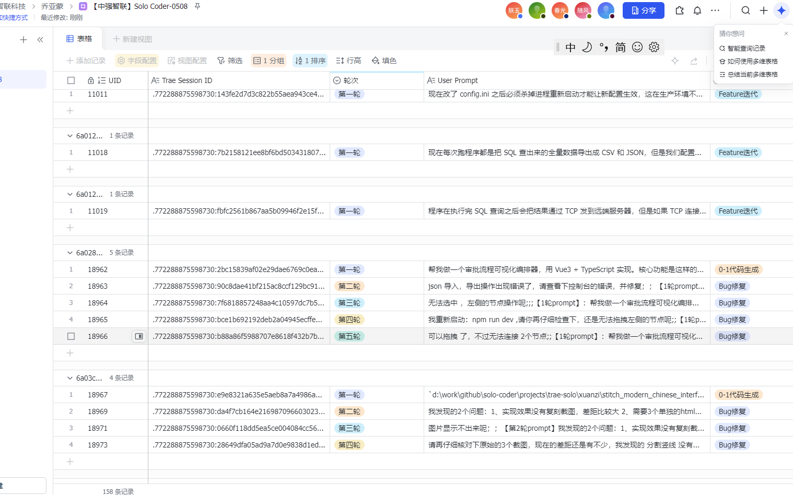
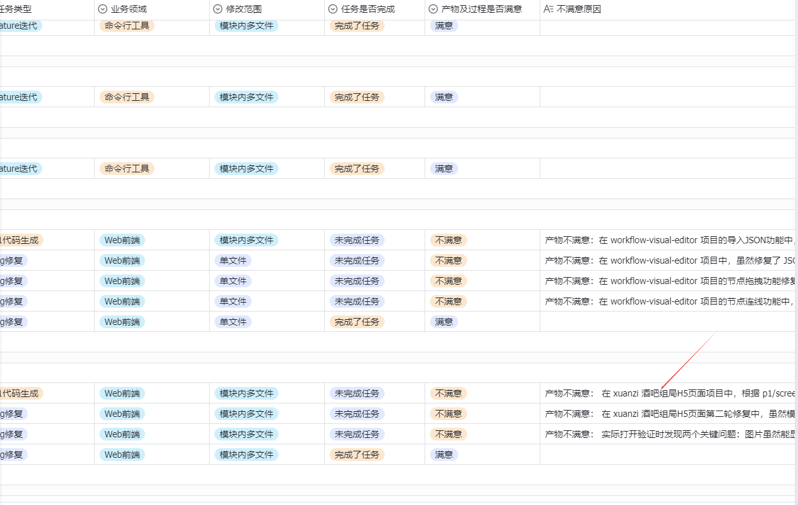
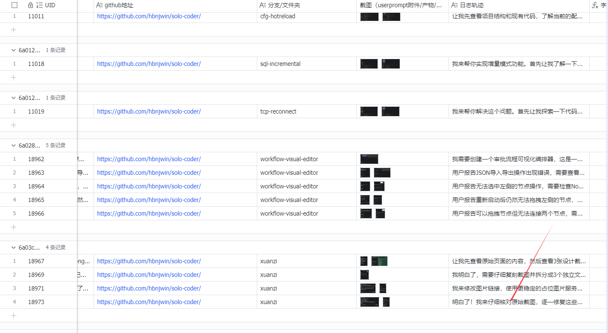

## 原始需求

我想本地做个skill: @docs/指引说明.md ， @docs/提交飞书表格.md ， @auto-solo-fill-tool/ 这是 一个题库维护工具， D:\work\github\solo-coder\projects\trae-solo，这是创建的项目，每个项目在 https://github.com/hbnjwin/solo-coder 都会创建 对应项目名的分支；根据 prompt 我发给 trae-solo-coder,例如 tsp2-standard-system-tree ；trae solo 会根据提示词，完成代码任务，我需要评估 每1轮，是否完成代码任务，对于 不满意的会 填写 不满意原因，给出下1轮的提示词，让solo-coder 继续；根据甲方要求 不能超过5轮，但 仅一轮的数据不能超过 8% ；







## 使用方式

### 技能列表

| 技能 | 命令 | 用途 |
|------|------|------|
| 评估轮次 | `/solo-evaluate <项目名> [轮次]` | 分析 trace 日志 + git diff，自动生成交付字段建议 |
| 生成不满意原因 | `/solo-reason <项目名> [轮次]` | 生成符合甲方质量要求的不满意原因 |
| 生成下轮 Prompt | `/solo-next <项目名> [轮次]` | 基于当前轮失败点生成下轮引导 prompt |
| 提交前校验 | `/solo-validate <项目名>` | 检查红线规则、字段完整性、单轮占比 |
| 进度统计 | `/solo-status` | 统计轮次分布、领域覆盖、交付进度 |

### 典型工作流

```
1. Trae Solo Coder 完成一轮 → 复制 trace 日志到 docs/result/
2. /solo-evaluate tsp2-xxx 1     → 拿到字段建议值，填入飞书表格
3. /solo-reason tsp2-xxx 1       → 不满意时生成合规原因
4. /solo-next tsp2-xxx 1         → 生成下轮 prompt 发给 Trae
5. /solo-validate tsp2-xxx       → 提交前合规检查
6. /solo-status                  → 定期查看单轮占比是否超标
```

---

### 实战示例：tsp2-standard-system-tree 第 1 轮

#### 1. `/solo-evaluate tsp2-standard-system-tree 1`

输入：trace 日志（docs/result/trace1.md）

输出：

```
## 评估结果

| 字段 | 建议值 | 判定依据 |
|------|--------|----------|
| 任务类型 | Feature 迭代 | 在已有烟草标准管理系统上增加树形管理和统计功能 |
| 业务领域 | 全栈 Web 应用 | Spring Boot + JPA 后端 + Vue 3 + Element Plus + ECharts 前端 |
| 修改范围 | 跨系统多模块 | 后端修改 4 个 Java 文件，前端新增 1 个 Vue 页面 + 修改 API 模块 |
| 任务难度 | 困难 | 树形递归 + 拖拽排序 + 多维统计 + 健康度算法 + ECharts |
| 任务是否完成 | 完成了任务 | 对照 prompt 6 个显性需求点均有对应实现 |
| 产物及过程是否满意 | 不满意 | 前端页面未注册路由，无法访问；过程中有 1 次编辑失败 |

### 过程分析
- 需求理解：正确，按 6 个需求点逐一实现
- 推进效率：较好，先读结构再动手，有 todo 规划；1 次 edit 失败后重读恢复
- 工具使用：25+ 次调用，1 次失败（4%），整体合理
- 沟通体验：最终给出完整功能总结

### 产物分析
- 功能完整性：6 个需求点代码层面均有实现
- 代码质量：未见明显语法错误
- 可运行性：未验证——前端新页面未配置路由，无法通过导航访问
```

#### 2. `/solo-reason tsp2-standard-system-tree 1`

输出（纯文本，像人写的反馈）：

```
产物不满意：前端那个标准体系管理页面，文件倒是创建了（standard-system/index.vue），但是没有在路由里注册，从菜单根本点不进去这个页面。需求里说的是要"新增标准体系管理页面"，结果页面代码写了，入口没加，等于这个功能完全不可用，树形结构和统计图表都看不到。

过程不满意：中间编辑 ServiceImpl 文件的时候 search_replace 失败了一次，匹配不上目标代码，后来重新读了文件才搞定。另外整个任务做完之后没有跑编译也没有启动验证，直接就说完成了，连 npm run dev 都没执行过，不知道代码到底能不能正常运行。
```

#### 3. `/solo-next tsp2-standard-system-tree 1`

输出（纯文本，像开发者在对话框里打字）：

```
上次写的标准体系管理页面代码都有了，但是没配路由，从菜单进不去。你把路由加一下，在左侧导航里也加个"标准体系管理"的入口。加完之后跑一下 npm run dev 确认页面能正常打开，树形结构能显示出来。后端那个 /api/standardSystem/tree 接口也确认下能正常返回嵌套的树形数据，别是扁平列表。
```

#### 4. `/solo-validate tsp2-standard-system-tree`

输出：

```
## 合规校验结果

### ✅ 通过项
- 第一轮非单文件修改（跨系统多模块）
- 题目难度足够（困难）
- 非代码理解类题目
- Session ID / GitHub 地址 / 日志轨迹已填写

### ❌ 不通过项
- 不满意原因尚未填写（产物不满意时必填）

### ⚠️ 警告项
- 当前仅 1 轮数据，如果最终只有 1 轮需注意单轮占比 < 8%

### 统计信息
- 总题目数：16
- 单轮题目数：0（占比 0%，要求 < 8%）
- 业务领域覆盖：全栈 Web 应用 ✅
```

---

### 注意事项

1. trace 日志放在 `docs/result/` 目录下，命名建议：`trace-{项目名}-r{轮次}.md`
2. 技能会自动读取 `docs/require/题库列表.md` 中的原始 prompt 作为需求基准
3. 技能会检查对应 git 分支的实际 diff 来判断修改范围
4. 不满意原因生成后请人工审核，确保与实际情况一致（AI 不一定对）
5. 下轮 prompt 生成后需人工调整措辞，避免模板化（甲方禁止）
