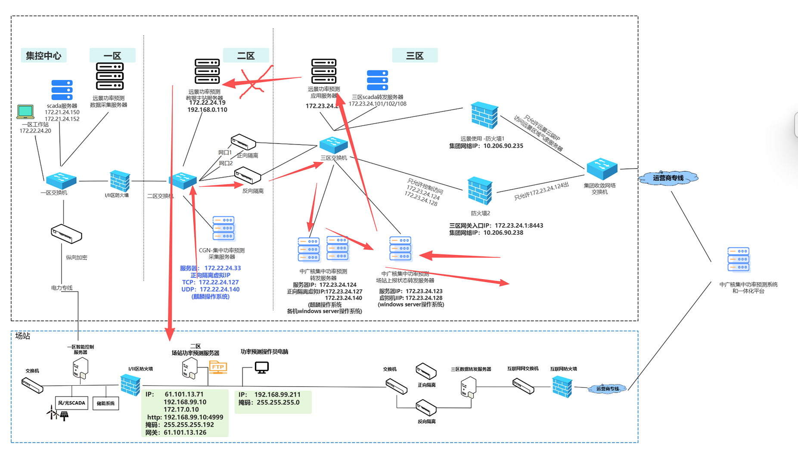
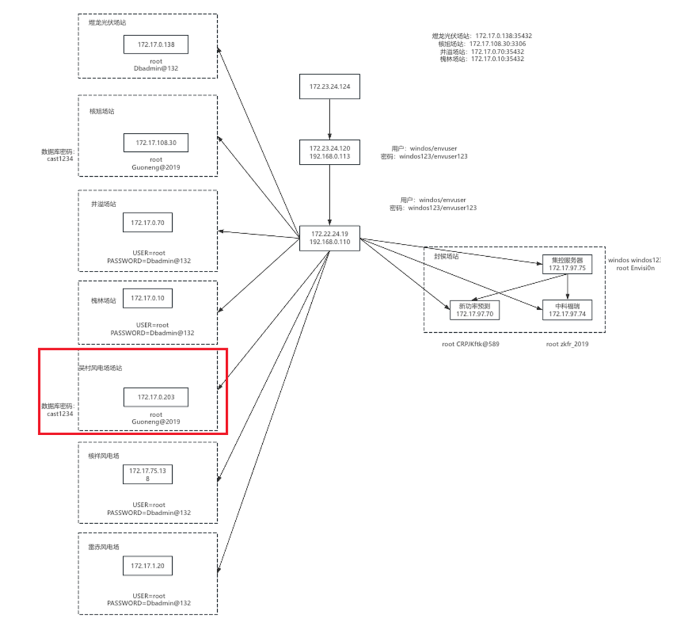

国能日新，金风的场站
先看槐林场站

原来：
场站--》拿走 rb 文件，解析--》集控--》一体化平台

改成：
方法一：直接访问场站的数据库，一天一次，取超短期数据(未来 4 小时)，短期数据(d-1，d-，d-3)的预测数据
读取上报记录，表 sql，命令行，------------------调研
上报记录，读取数据，正向隔离，放到 kafca--》--通过正向隔离传出，不用管
方法二：读取 rb 文件，解析

集控陕西远程地址 677218340 1qazXSW@3edcCGN!sx

ssh windos@172.23.24.120

密码：windos123

ssh windos@192.168.0.110

# 煜龙

ssh root@172.17.0.138

Dbadmin@132

docker exec -it 7fa62 /bin/bash

psql -U powerforecast -p 35432

## 操作步骤

to_desk:

windowsServer2008 R2
本机地址：172.23.24.128 网关 ：172.23.24.1

### 跳板机 1

ssh windos@172.23.24.120

密码：windos123

172.23.24.120 -- 192.168.0.113(内网地址)

Linux central-station0001 3.10.0-1062.el7.x86_64 #1 SMP Wed Aug 7 18:08:02 UTC 2019 x86_64 x86_64 x86_64 GNU/Linux

cat /etc/os-release

系统名称：CentOS Linux
版本：7 (Core)
ID：centos
ID_LIKE：rhel fedora（表示与 Red Hat Enterprise Linux 和 Fedora 系列类似）
PRETTY_NAME：CentOS Linux 7 (Core)
主页：https://www.centos.org/

### 跳板机 2

ssh windos@192.168.0.110      二区 ：主站服务器
也是 centos 的机器

这台 CentOS 系统有两块物理网卡（ens32 和 ens192），分别连接到了不同的网络：
ens32：内网段 192.168.0.x（可能是办公室或虚拟机内部网） .110
ens192：172.22.24.x（可能是另一个 VLAN 或公网段） .19
两块网卡的数据收发量比较大，说明这台机器可能是跑服务或作为网络中转。
网络状况很好，没有 packet loss（丢包）、overruns（缓冲区溢出）或 collisions（冲突）。

### 跳板机 3

煜龙的服务器

ssh root@172.17.0.138

Dbadmin@132

docker exec -it 7fa62 /bin/bash

槐林场站数据库

ssh root@172.17.0.10

Dbadmin@132

docker exec -it pf_postgres /bin/bash

psql -U powerforecast -p 35432

ssh root@172.17.108.30。 核旭电站  mysql
Guoneng@2019

信息解析如下：

PRETTY_NAME: Linx GNU/Linux 6.0.80 (jessie)
NAME: Linx GNU/Linux
VERSION_ID: 8
VERSION: 8 (jessie)
ID: linx
HOME_URL: http://www.linx-info.com/
这个系统看起来像是基于 Linux 的一个发行版，名字是 Linx，版本 8，代号 jessie（jessie 是 Debian 的一个版本代号，说明可能是基于 Debian 开发的）。

root@sprixin:/usr/local/mysql/bin# ./mysql -u sa -p

./mysql -u sa -p
cast1234

SELECT ID, FCST_TIME, P
FROM hdrfcstdata
ORDER BY FCST_TIME DESC
LIMIT 100;

SELECT ID, FCST_TIME, P 
FROM hdrfcstdata_hxgf 
ORDER BY FCST_TIME DESC 
LIMIT 10;

SELECT ID, FCST_TIME, CAST(P AS CHAR) AS p
FROM hdrfcstdata_jm_hxgf
ORDER BY FCST_TIME DESC
LIMIT 10;

SELECT ID, FCST_TIME, P
FROM hdrfcstdata_hxgf
ORDER BY FCST_TIME DESC
LIMIT 10;

SELECT ID, FCST_TIME, P
FROM hdrfcstdata
ORDER BY FCST_TIME DESC
LIMIT 10;

## 查用命令

#!/bin/bash
echo "=== 系统版本信息 ==="
cat /etc/os-release
echo ""
echo "=== 内核版本信息 ==="
uname -a

\c powerforecast
或者使用完整的连接命令：

bash
psql -U powerforecast -p 35432 -d powerforecast
进入数据库后的常用命令：

\dt - 查看所有表
\d 表名 - 查看表结构
\l - 查看所有数据库
\q - 退出 PostgreSQL
您已经在 PostgreSQL 提示符下，直接输入 \c powerforecast 即可切换到 powerforecast 数据库。

## 数据库

| 序号 | 场站名称     | 数据库状态 |    用户名     |     密码     | 端口  | 数据库类型 | 状态 |   平台   | 网址                                                                   | 内网 IP         | 操作系统                 | 内存  | CPU  | 备注                   |
| :--: | :----------- | :--------: | :-----------: | :----------: | :---: | :--------: | :--: | :------: | :--------------------------------------------------------------------- | :-------------- | :----------------------- | :---: | :--: | :--------------------- |
|  1   | 槐林光伏电站 |     OK     | powerforecast | pf@gwV632023 | 35432 | postgresql |  OK  |   金风   | [链接](https://192.168.99.10:4999/fe/#running?appID=PF)                | 192.168.99.211  | Win 10                   |  4G   | 4 核 | 已安装上报状态监控程序 |
|  2   | 井溢光伏电站 |     OK     | powerforecast | pf@gwV632023 | 35432 | postgresql |  OK  |   金风   | [链接](https://127.0.0.1:32000)                                        | 192.168.99.231  | CentOS Linux 7           | 3.6G  | 4 核 | 准备                   |
|  3   | 核旭光伏电站 |     OK     |      sa       |   cast1234   | 3306  |   mysql    |  OK  | 国能日新 | [链接](https://192.168.27.1:18080/SPPP-web/index)                      | 192.168.99.231  | 凝思安全操作系统 V6.0.80 | 3.65G | 2 核 | -                      |
|  4   | 煜龙光伏电站 |     OK     | powerforecast | pf@gwV632023 | 35432 | postgresql |  OK  |   金风   | [链接](https://192.168.99.10:8347/wpfore/powerPlantQuery/M2501.action) | 192.168.99.100  | Linux 4.19.0-1           | 7.24G | 4 核 | -                      |
|  5   | 封侯光伏电站 |     OK     |       -       |      -       |   -   |     -      |  -   |  中广核  | 无网址                                                                 | 192.168.1.210   | CentOS 7                 |  6G   | 8 核 | -                      |
|  6   | 核耀光伏电站 |     -      |       -       |      -       |   -   |     -      |  -   | 中科伏瑞 | 客户端                                                                 | 192.168.1.212   | 凝思                     |  8G   | 4 核 | -                      |
|  7   | 核皓光伏电站 |     -      |       -       |      -       |   -   |     -      |  -   | 国能日新 | [链接](https://192.168.127.1:18080/SPPP.web/index)                     | 192.167.127.110 | 凝思                     |  4G   | 2 核 | -                      |
|  8   | 四十铺风电场 |     -      |       -       |      -       |   -   |     -      |  -   |   金风   | [链接](https://192.168.99.10:4999/fe/#running?appID=PF)                | 192.168.99.231  | Win 7                    |  4G   | 2 核 | 准备                   |
|  9   | 核祥风电场   |     -      | powerforecast | pf@gwV632023 | 35432 | postgresql |  -   |   金风   | [链接](https://192.168.99.10:8347)                                     | 192.168.99.100  | 麒麟                     |  8G   | 6 核 | 准备                   |
|  10  | 雷赤风电场   |     -      | powerforecast | pf@gwV632023 | 35432 | postgresql |  -   |   金风   | [链接](https://192.168.99.10:4999/fe/#running?appID=PF)                | 192.168.99.231  | CentOS 7                 |  4G   | 2 核 | -                      |
|  11  | 吴村风电场   |     -      |      sa       |   cast1234   | 3306  |   mysql    |  -   | 国能日新 | [链接](https://192.168.127.1:8080/SPPP-web/index?version=V3.9.0.12079) | 192.168.127.7   | 麒麟系统                 |  4G   | 2 核 | -                      |
|  12  | 如意风电场   |     -      |       -       |      -       |   -   |     -      |  -   |   远景   | [链接](http://172.31.67.10:8080/windos/)                               | 172.31.67.10    | 银河麒麟 Linux           | 7.2G  | 6 核 | -                      |

### 数据库类型统计

|    类型    | 数量 |
| :--------: | :--: |
| PostgreSQL |  5   |
|   MySQL    |  2   |
|   未配置   |  5   |

### 平台统计

|   平台   | 数量 |
| :------: | :--: |
|   金风   |  5   |
| 国能日新 |  3   |
|  中广核  |  1   |
| 中科伏瑞 |  1   |
|   远景   |  1   |
|  未配置  |  1   |
